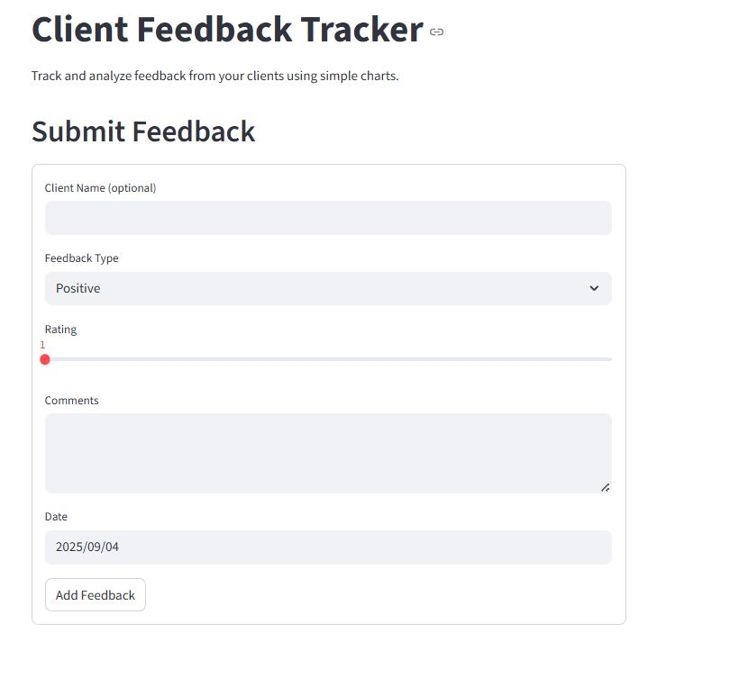
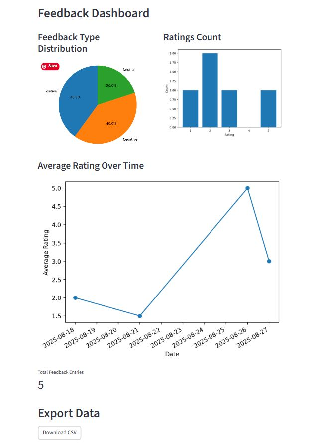

# Feedback tracker

A Streamlit app to log client feedback.

## Features included 
- Add feedback including, ratings, comment and date
- View charts representing the data
- Export to CSV

## How to run it
pip install streamlit
streamlit run feedback_tracker.py

## Screenshots

### Feedback Form

### Dashboard

